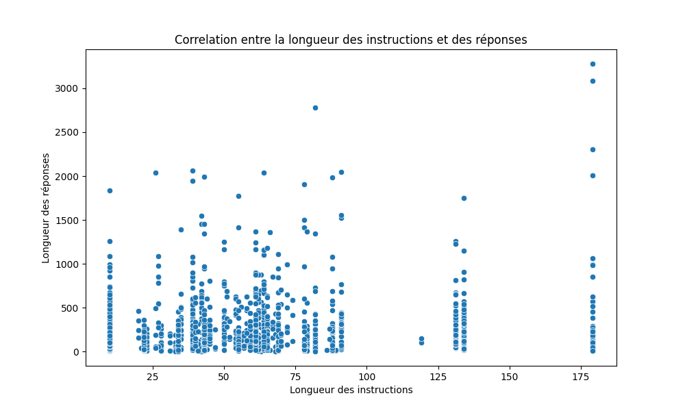
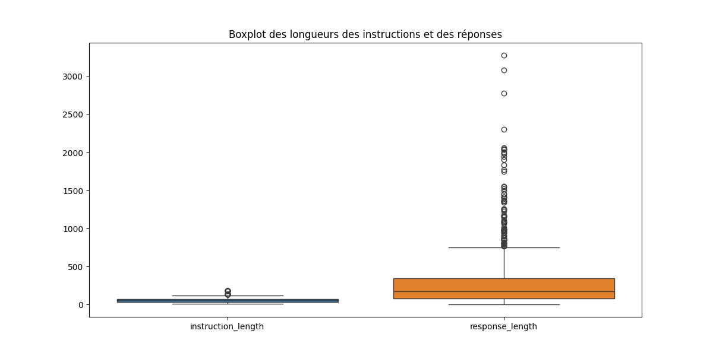

# Outils-traitement-corpus
## TD Cours n°1

### Tâche réalisée
J'ai choisi une tâche de génération de réponses à des instructions, impliquant la création de modèles capables de répondre à divers types de questions et prompts de manière cohérente et informative.

### Corpus qui répond à cette tâche
Pour le corpus, j'ai choisi le **Databricks Dolly 15K**, qui comprend 15 000 paires prompt-réponse générées par des humains. Ce dataset est destiné à l'entraînement de modèles pour des tâches de traitement du langage naturel, comme la génération de texte, la réponse à des questions et la synthèse d'information.

Ce corpus est sous licence **CC BY-SA 3.0**, ce qui permet de l'utiliser librement tout en partageant les mêmes conditions.

### Type de prédiction
Ce corpus permet de réaliser des tâches de classification et de génération de texte, notamment pour des applications de type assistant virtuel ou chatbot.

### À quel modèle il a servi
Le Databricks Dolly 15K a été utilisé pour développer le modèle **Dolly**, un modèle de traitement du langage naturel capable de comprendre et de générer des réponses à des instructions variées.

### Constitution de mon propre corpus
Pour constituer mon propre corpus, je pourrais utiliser des méthodes similaires en collectant des données de prompt-réponse sur divers sujets via des plateformes participatives ou en utilisant des outils de génération de texte pour enrichir le dataset existant.

## TD 2 : Scraping et Structuration de Corpus

### Objectif
Constituer un corpus structuré en extrayant des données pertinentes depuis Reddit.

### Pourquoi Reddit ? 
Reddit est une plateforme idéale pour extraire des questions et réponses car elle contient de nombreuses discussions sur une variété de sujets. Les subreddits spécialisés permettent de cibler des domaines spécifiques, comme MachineLearning pour des discussions techniques et informatives. De plus, la structure des discussions Reddit facilite l'extraction de contextes et de réponses.

### Étapes Réalisées

1. **Configuration de l'API Reddit**
   - Création d'une application Reddit pour obtenir les identifiants API.
   - Configuration de `praw` pour interagir avec l'API Reddit.

2. **Scraping de Données**
   - Récupération des posts et commentaires du subreddit `MachineLearning`.
   - Extraction des instructions (questions), réponses et contextes des discussions.

3. **Catégorisation Dynamique**
   - Utilisation d'expressions régulières pour assigner des catégories aux instructions (e.g., `general_qa`, `brainstorming`, `classification`).

4. **Nettoyage et Sauvegarde des Données**
   - Nettoyage des données extraites pour supprimer les espaces superflus.
   - Sauvegarde des données brutes et nettoyées dans des fichiers JSON.
### Script Développé

Le script développé réalise les tâches suivantes :
- Configuration de l'API Reddit avec `praw`.
- Extraction des questions (instructions) et des réponses (comments) depuis Reddit.
- Ajout du contexte des discussions à partir du texte des posts.
- Catégorisation dynamique des instructions basées sur des mots-clés.
- Nettoyage des données pour supprimer les espaces et caractères superflus.
- Sauvegarde des données brutes et nettoyées dans des fichiers JSON.

### Résultats
- Un corpus structuré avec les champs `instruction`, `context`, `response` et `category`.
- Les données sont prêtes pour une analyse ou un entraînement de modèles NLP.

## TD 3 : Stocker et Charger des Données Annotées

### Objectif
Stocker efficacement les données récupérées et les charger dans Python pour les explorer et les annoter.

### Étapes Réalisées

1. **Stockage des Données**
   - Conversion des données nettoyées au format CSV et JSON pour une meilleure accessibilité.

2. **Chargement des Données**
   - Utilisation de pandas pour charger les fichiers CSV et JSON dans Python.

3. **Annotation avec spaCy**
   - Utilisation de spaCy pour annoter les réponses en extrayant les entités nommées.

### Résultats
- Les données nettoyées ont été stockées aux formats CSV et JSON.
- Les données ont été chargées dans Python pour exploration.
- Les réponses ont été annotées en utilisant spaCy, et les annotations ont été sauvegardées dans un fichier JSON.

## TP 4 : Calcul et Visualisation de Métriques Pertinentes

### Métriques Calculées
Pour ce TP, j'ai choisi de calculer quelques métriques pertinentes pour analyser mon corpus :
#### Longueur des Textes
- Longueur moyenne, maximale et minimale des réponses.

#### Nombre de Mots
- Nombre moyen de mots par réponse.

#### Distribution des Longueurs de Texte
- Histogramme montrant la distribution des longueurs de texte.

#### Distribution du Nombre de Mots
- Histogramme montrant la distribution du nombre de mots par réponse.

#### Loi de Zipf
- Analyse de la loi de Zipf pour les fréquences des mots dans le corpus.

### Scripts Développés
#### Script de Structuration des Données
- Ce script charge les données depuis un fichier CSV, les insère dans une base de données SQLite, et retourne les données structurées.

#### Script de Calcul et Visualisation des Statistiques
- Ce script calcule les statistiques de longueur des textes et du nombre de mots, visualise ces données, effectue une analyse de la loi de Zipf, et annote les réponses avec spaCy pour extraire les entités nommées.

### Visualisations Générées
Les graphiques suivants ont été générés et sauvegardés dans le dossier [plots](./plots) :

- 
- 
- 

## TP 5 : Calcul de la Corrélation, agrandissement du corpus, division du corpus. 

### Objectif
L'objectif de ce TP était de calculer la corrélation entre la longueur des instructions et celle des réponses dans un corpus de données. J'ai utilisé un script Python pour effectuer cette analyse.

### Script développé
Le script a été développé pour charger les données depuis un fichier JSON, calculer les longueurs des instructions et des réponses, puis déterminer la corrélation entre ces deux variables. J'ai également visualisé cette corrélation à l'aide de scatter plots et de boxplots pour mieux comprendre la distribution des données.

### Résultats

Coefficient de corrélation: 0.13266624087033163
P-value: 5.333516116185883e-06
### Interprétation des résultats
- **Faible corrélation positive** : Le coefficient de corrélation de 0.13266624087033163 indique une faible corrélation positive entre la longueur des instructions et des réponses. Cela signifie qu'il y a une légère tendance pour les réponses plus longues à être associées à des instructions plus longues, mais cette relation n'est pas très forte.
- **Significativité statistique** : La p-value très faible (5.333516116185883e-06) indique que la corrélation observée est statistiquement significative, ce qui signifie qu'il est très improbable que cette corrélation soit due au hasard.

### Visualisations
J'ai également généré des visualisations pour mieux comprendre la distribution des données et identifier d'éventuelles valeurs aberrantes.

- **Scatter plot de la corrélation** : La visualisation montre une dispersion des points, indiquant une faible corrélation entre les longueurs des instructions et des réponses.

- **Boxplot des longueurs des instructions et des réponses** : Le boxplot montre une grande variabilité dans les longueurs des réponses, avec plusieurs valeurs aberrantes visibles.

### Agrandissement du corpus 
Il suffit de modifier le script scraper.py et d'y ajouter d'autres subreddits.

### Découper le corpus 

Pour ce faire, on va travailler sur le fichier scraped_data.json qui contient les données nettoyées et structurées, à l'aide du script decoupage.py
## decoupage.py 

Ce script utilise train_test_split de sklearn pour diviser les données en deux parties : 80% pour l'apprentissage et 20% pour le test. Les résultats sont sauvegardés dans deux nouveaux fichiers JSON : scraped_data_train.json et scraped_data_test.json.

